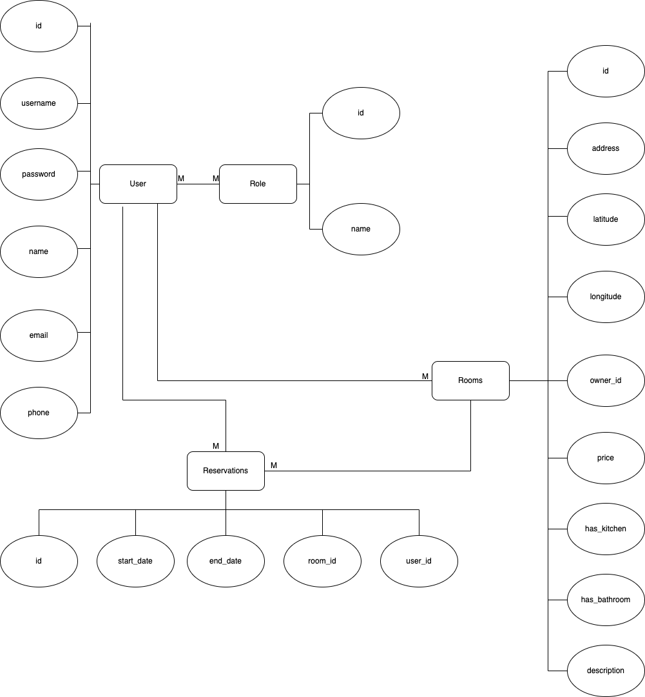

# Refugee Shelter

### Цель работы

Целью работы является разработка WEB-приложения, которое предоставляет возможность сдачи/поиска жилья беженцам.

### Решаемая проблема

Данный сайт решает проблему поиска временного жилья за границей.
Множеству людей, покинувших по всевозможным причинам свою страну, приходится в кратчайшие сроки искать жилье, однако владельцы не всегда готовы сдавать квартиру беженцам.

### Функционал

- Регистрация
- Вход в систему
- Выход из системы
- Просмотр доступного жилья
- Просмотр информации о конкретом объекте недвижимости
- Размещение/Бронирование жилья
- Просмотр размещенного жилья конкретного пользователя
- Просмотр/редактирование информации о конкретном пользователе

### Use-case диаграмма

### Er-диаграмма сущностей системы

### swagger

[Click me](https://app.swaggerhub.com/apis/Sunshine-ki/WEB/1.0.0)

### Figma

[Click me](https://www.figma.com/file/UCTIiw26m0M98zIjS76zjg/SE?node-id=0%3A1)

### Moodboard

[Click me](https://www.pinterest.ru/sukochevaalis/se-web/)
